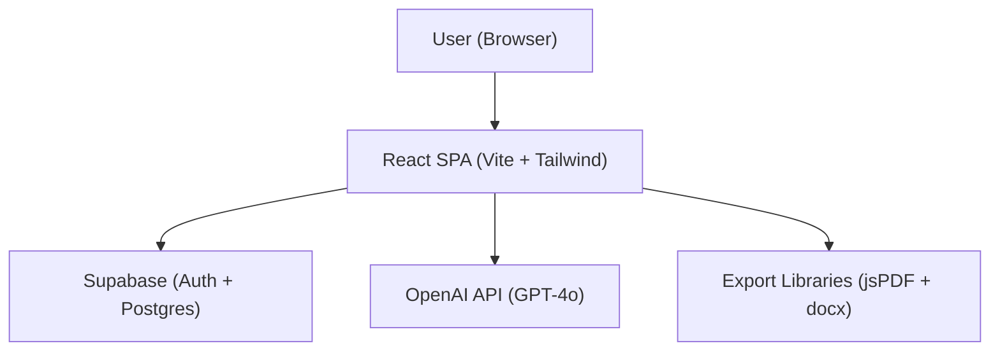
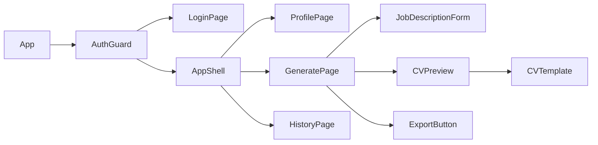

# Design Document: CV Generator

## Overview

The CV Generator is a React single-page application that lets users store their professional profile once in Supabase, then generate AI-tailored CVs on demand by pasting a job description. The AI rewrites and reorders CV content to match the role, and the result is downloadable as PDF or Word. The app uses Supabase for auth and data persistence, an AI provider (OpenAI) for tailoring, and client-side libraries for document export.

---

## Architecture



The app is entirely client-side rendered. Supabase handles auth and stores the CV profile and history. The OpenAI API is called directly from the client using a user-scoped API key stored in Supabase (or via a Supabase Edge Function to keep the key server-side). Export happens entirely in the browser.

### Key Architectural Decisions

- **Supabase Edge Function for AI calls**: The OpenAI API key is kept server-side in a Supabase Edge Function (`tailor-cv`). The client sends the CV profile and job description; the function returns the tailored CV JSON. This avoids exposing the API key in the browser bundle.
- **Client-side export**: PDF and Word generation happen in the browser using `jsPDF` and `docx` libraries, avoiding any server-side file generation.
- **Optimistic UI**: The profile form saves immediately with a loading state; errors roll back.

---

## Components and Interfaces



### Component Responsibilities

| Component | Responsibility |
|---|---|
| `AuthGuard` | Redirects unauthenticated users to login |
| `LoginPage` | Email/password login and registration via Supabase Auth |
| `ProfilePage` | Form for entering and saving the full CV profile |
| `GeneratePage` | Orchestrates job description input → AI call → preview → export |
| `JobDescriptionForm` | Textarea + submit button with validation |
| `CVPreview` | Renders the `TailoredCV` using `CVTemplate` |
| `CVTemplate` | Pure presentational component; renders all CV sections |
| `ExportButton` | Format picker (PDF/Word) and triggers export |
| `HistoryPage` | Lists past tailored CVs; clicking one loads it into preview |

### Service Interfaces

```typescript
// Profile service
interface ProfileService {
  getProfile(userId: string): Promise<CVProfile | null>;
  saveProfile(userId: string, profile: CVProfile): Promise<void>;
}

// AI tailoring service (calls Supabase Edge Function)
interface TailoringService {
  tailorCV(profile: CVProfile, jobDescription: string): Promise<TailoredCV>;
}

// Export service
interface ExportService {
  exportPDF(cv: TailoredCV, fileName: string): void;
  exportDocx(cv: TailoredCV, fileName: string): void;
}

// History service
interface HistoryService {
  saveHistory(userId: string, entry: HistoryEntry): Promise<void>;
  getHistory(userId: string): Promise<HistoryEntry[]>;
}
```

---

## Data Models

### CVProfile (stored in Supabase `profiles` table)

```typescript
interface CVProfile {
  userId: string;
  fullName: string;
  email: string;
  phone: string;
  location: string;
  linkedinUrl?: string;
  summary: string;
  experience: WorkExperience[];
  education: Education[];
  skills: string[];
}

interface WorkExperience {
  jobTitle: string;
  company: string;
  startDate: string;   // ISO date string "YYYY-MM"
  endDate: string | null; // null = present
  description: string;
}

interface Education {
  degree: string;
  institution: string;
  graduationYear: number;
}
```

### TailoredCV (returned by AI, stored in `cv_history` table)

```typescript
interface TailoredCV {
  fullName: string;
  email: string;
  phone: string;
  location: string;
  linkedinUrl?: string;
  tailoredSummary: string;
  experience: WorkExperience[];  // reordered/emphasized subset
  education: Education[];
  skills: string[];              // filtered/reordered subset
}
```

### HistoryEntry (stored in Supabase `cv_history` table)

```typescript
interface HistoryEntry {
  id: string;
  userId: string;
  jobDescriptionSnippet: string; // first 200 chars of job description
  tailoredCV: TailoredCV;
  createdAt: string;             // ISO timestamp
}
```

### Supabase Schema

```sql
-- profiles table
create table profiles (
  user_id uuid primary key references auth.users(id),
  data jsonb not null,
  updated_at timestamptz default now()
);

-- cv_history table
create table cv_history (
  id uuid primary key default gen_random_uuid(),
  user_id uuid references auth.users(id),
  job_description_snippet text,
  tailored_cv jsonb not null,
  created_at timestamptz default now()
);

-- Row Level Security
alter table profiles enable row level security;
create policy "Users can only access their own profile"
  on profiles for all using (auth.uid() = user_id);

alter table cv_history enable row level security;
create policy "Users can only access their own history"
  on cv_history for all using (auth.uid() = user_id);
```

### AI Prompt Contract

The Supabase Edge Function sends this structured prompt to OpenAI:

```
System: You are a professional CV writer. Given a candidate's full CV profile and a job description, 
produce a tailored CV in JSON format. Rules:
1. Only use information present in the original profile — do not fabricate anything.
2. Rewrite the summary to align with the job description.
3. Reorder experience entries to put the most relevant first.
4. Filter and reorder skills to highlight those matching the job description.
5. Return valid JSON matching the TailoredCV schema exactly.

User: 
CV Profile: <JSON>
Job Description: <text>
```

---

## Correctness Properties

*A property is a characteristic or behavior that should hold true across all valid executions of a system — essentially, a formal statement about what the system should do. Properties serve as the bridge between human-readable specifications and machine-verifiable correctness guarantees.*

### Property 1: Profile round-trip consistency

*For any* valid `CVProfile` object, saving it to Supabase and then retrieving it should produce an object equal to the original.

**Validates: Requirements 2.2, 2.3**

---

### Property 2: AI tailoring preserves factual integrity

*For any* `CVProfile` and `Job_Description`, the `TailoredCV` returned by the AI service must contain only skills, experience entries, and education entries that exist in the original `CVProfile`. No new items may be introduced.

**Validates: Requirements 4.5**

---

### Property 3: Tailored skills are a subset of profile skills

*For any* `CVProfile` and `Job_Description`, every skill in `TailoredCV.skills` must appear in `CVProfile.skills`.

**Validates: Requirements 4.4, 4.5**

---

### Property 4: Tailored experience is a subset of profile experience

*For any* `CVProfile` and `Job_Description`, every `WorkExperience` entry in `TailoredCV.experience` must correspond to an entry in `CVProfile.experience` (matched by company + jobTitle + startDate).

**Validates: Requirements 4.3, 4.5**

---

### Property 5: Export file name format

*For any* `TailoredCV` with a given `fullName` and current date, the exported file name must match the pattern `[fullName]_CV_[YYYY-MM-DD].[ext]` where spaces in the name are replaced with underscores.

**Validates: Requirements 6.4**

---

### Property 6: History entries preserve tailored CV content

*For any* `TailoredCV` that is saved to history, retrieving that history entry and reading its `tailoredCV` field must produce an object equal to the original `TailoredCV`.

**Validates: Requirements 7.1**

---

### Property 7: Empty job description is rejected

*For any* string composed entirely of whitespace (including the empty string), submitting it as a `Job_Description` must be rejected and no AI call must be made.

**Validates: Requirements 3.2**

---

### Property 8: Profile required before generation

*For any* authenticated user with no saved `CVProfile`, submitting a `Job_Description` must be rejected and no AI call must be made.

**Validates: Requirements 3.3**

---

## Error Handling

| Scenario | Behavior |
|---|---|
| Auth failure (login/register) | Display field-level error from Supabase; no session created |
| Profile save failure | Show toast error; retain form data; allow retry |
| Empty job description | Inline validation error; block submission |
| No profile saved | Inline prompt to complete profile; block submission |
| AI service timeout / error | Show error banner with retry button; preserve job description input |
| Export failure | Show toast error; allow retry |
| History load failure | Show error state in history list; allow retry |

---

## Testing Strategy

### Unit Tests (Vitest)

Focus on specific examples, edge cases, and pure functions:

- `ProfileService`: save and retrieve with mock Supabase client
- `ExportService`: verify file name generation logic for various name formats
- `TailoringService`: mock OpenAI response; verify schema validation of returned JSON
- `JobDescriptionForm`: empty string, whitespace-only string, valid string
- `CVTemplate`: snapshot test to ensure all sections render

### Property-Based Tests (fast-check)

Each property test runs a minimum of 100 iterations. Tests are tagged with the property they validate.

**Property test library**: `fast-check` (TypeScript-native, works with Vitest)

| Property | Test Description |
|---|---|
| Property 1 | Generate random `CVProfile`, save → retrieve, assert deep equality |
| Property 2 | Generate random profile + job description, call AI mock, assert no new items in output |
| Property 3 | Generate random profile + job description, assert `tailoredSkills ⊆ profileSkills` |
| Property 4 | Generate random profile + job description, assert `tailoredExperience ⊆ profileExperience` |
| Property 5 | Generate random full names and dates, assert file name matches regex pattern |
| Property 6 | Generate random `TailoredCV`, save → retrieve history, assert deep equality |
| Property 7 | Generate whitespace-only strings, assert submission is rejected |
| Property 8 | Simulate null profile state, assert generation is blocked |

**Tag format**: `Feature: cv-generator, Property {N}: {property_text}`

Properties 3 and 4 are intentionally kept separate (skills vs experience) for precise failure diagnosis, even though both validate 4.5. Property 2 is a broader integrity check that subsumes them conceptually, but the specific subset checks (3 and 4) provide clearer failure messages.
